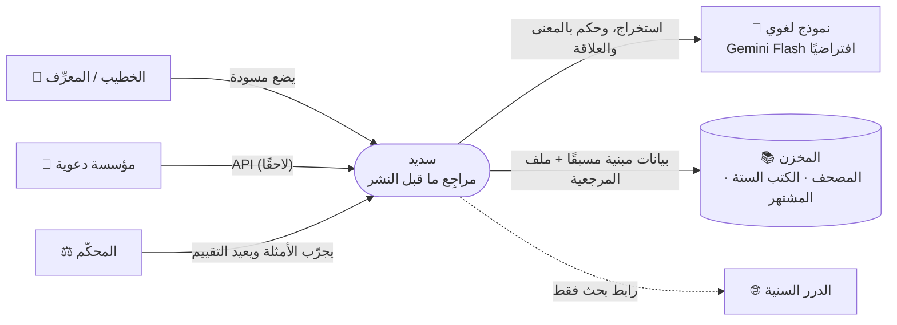
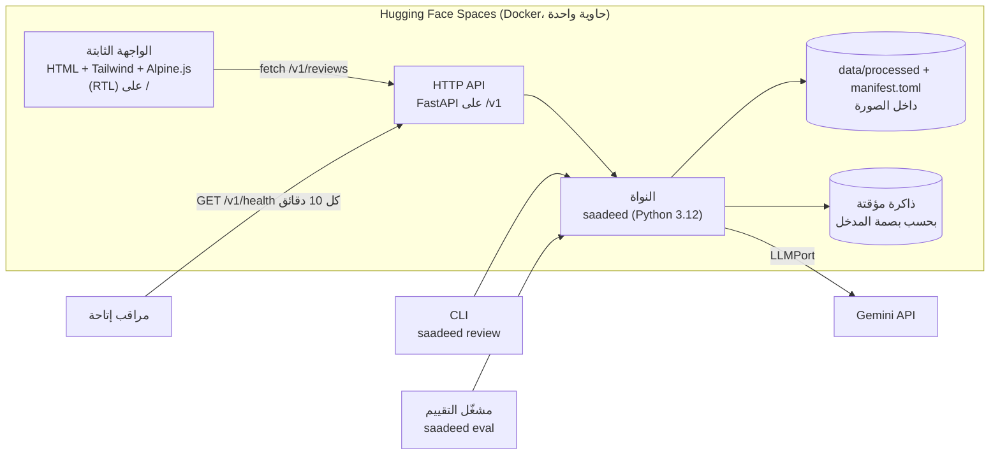
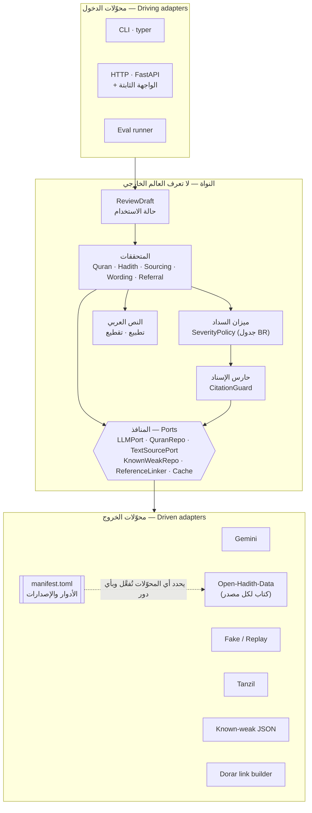
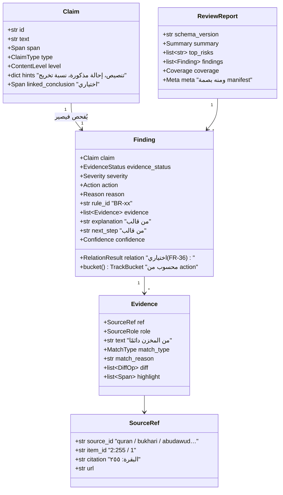
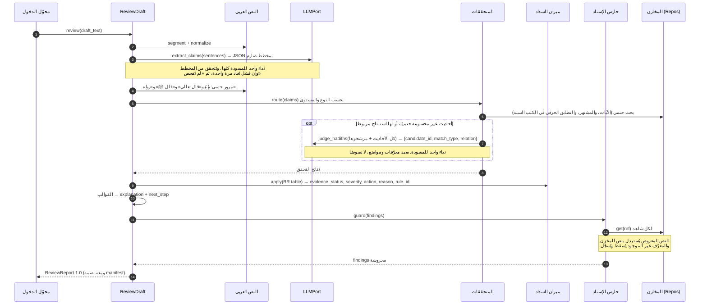
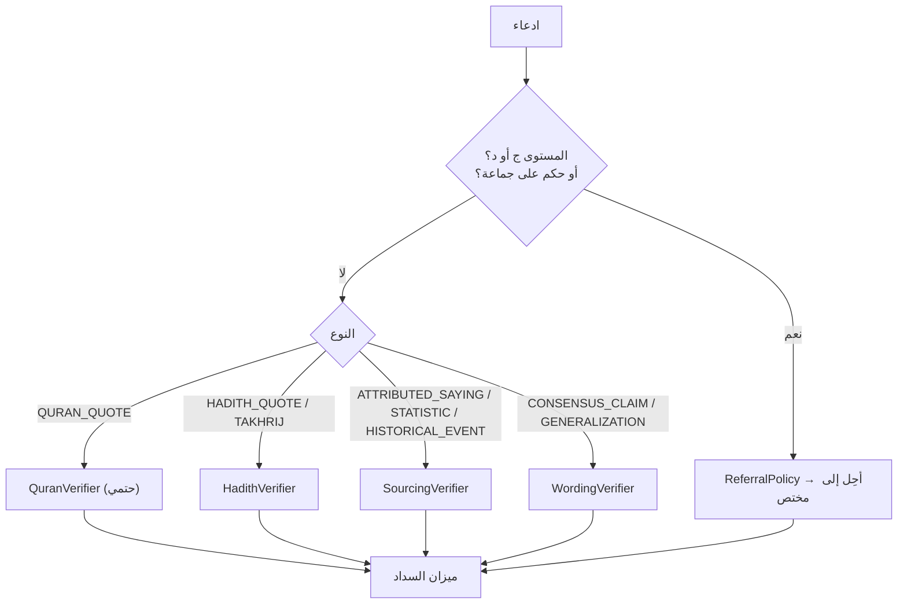
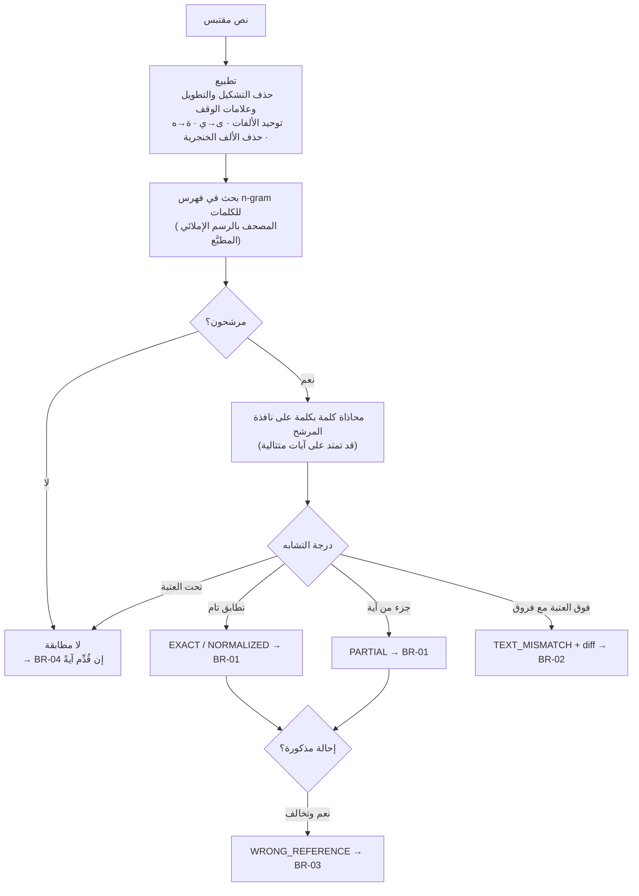
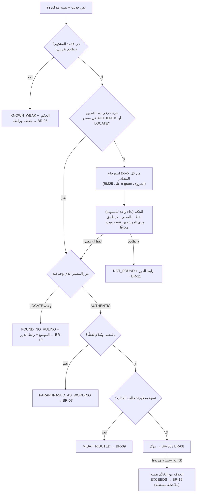
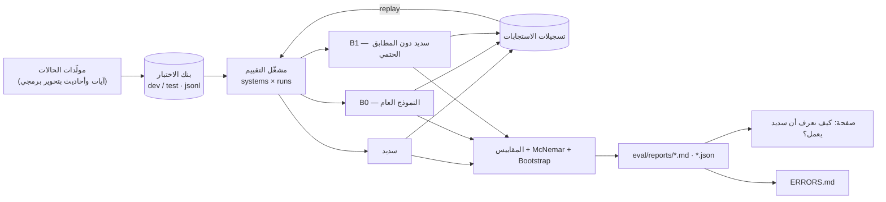
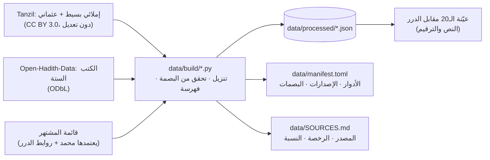

# ٠٤ — المعمارية الهندسية

> **الحالة:** النسخة 2 — 4 أكتوبر 2026 · **مشتقة من:** [المتطلبات](03-requirements.md) والمبادئ م١٢–م١٦
> **القرارات:** 0001 السداسية · 0002 التقنيات · 0003 النموذج · 0004 الآيات · 0009 الأبعاد · 0010 المصادر · 0011 التجاوز · 0012 النشر
> الرسوم بلغة **Mermaid**، يعرضها GitHub تلقائيًا. والمعرّفات في الكود بالإنجليزية بحسب المسرد.
>
> **ما تغيّر عن النسخة 1:**
> 1. **نشر واحد:** حاوية على HF Spaces تخدم الـ API والواجهة الثابتة معًا. لا Vercel ولا Next.js.
> 2. **منفذ موحّد للمصادر النصية** (`TextSourcePort`) مع **ملف المرجعية المعتمدة** وأدوار المصادر. والكتب الستة من Open-Hadith-Data.
> 3. **الملاحظة بثلاثة أبعاد.** و`LLMPort` بوظيفتين فقط (`extract_claims` و`judge_hadiths`). والشرح من قوالب.

---

## ١. السياق: سديد ومن حوله (المستوى الأول في نموذج C4)



## ٢. الحاويات والنشر



> **مراقب الإتاحة إلزامي:** HF Spaces المجانية تنام بعد 48 ساعة بلا طلبات. والمراقب يبقيها مستيقظة طوال التحكيم (7–22 أكتوبر).

## ٣. المعمارية السداسية (المنافذ والمحوّلات)



**قواعد الاعتماد** (تفرضها أداة `import-linter` في كل بناء):

| الطبقة | تستورد من | لا تستورد أبدًا |
|---|---|---|
| `domain` | المكتبة القياسية وpydantic فقط | أي شيء آخر |
| `text` | `domain` | المحوّلات |
| `verifiers` | `domain`، `text`، `application.ports` | المحوّلات |
| `application` | `domain`، `text`، `verifiers` | المحوّلات |
| `adapters` | أي طبقة | — |

## ٤. نموذج النطاق



## ٥. مسار الفحص (تسلسل الاستدعاءات)



## ٦. توجيه الادعاءات إلى المتحققات



## ٧. المتحققان الأساسيان

### ٧.١ مطابق الآيات (حتمي بالكامل، ولا يستدعي النموذج)



- **العرض:** المطابقة على النص الإملائي المطبَّع، وعرض الآية للمستخدم **بالرسم العثماني من المخزن**.
- **العتبات** تُضبط على مجموعة التطوير فقط.
- **quran-detector** (MIT): يُجرَّب ساعة في T-106 كاشفًا للآيات غير المعلَّمة. والمحاذاة والفرق من كودنا في كل الأحوال.

### ٧.٢ متحقق الأحاديث



## ٨. المنافذ (Ports)، بالتوقيعات لا بالتنفيذ

| المنفذ | الوظائف | المحوّلات |
|---|---|---|
| `LLMPort` | `extract_claims(sentences) → ClaimSet` · `judge_hadiths(items) → list[Judgment]` | Gemini، وFake (للاختبارات)، وReplay (للتقييم) |
| `QuranRepo` | `search(normalized_tokens) → candidates` · `get(ref) → Ayah` | Tanzil |
| `TextSourcePort` | `search(text, k) → candidates` · `find_substring(normalized) → hits` · `get(item_id) → Passage` · `info → SourceInfo(role, version…)` | `OpenHadithSource` (مثيل لكل كتاب). ولاحقًا: كتاب نصي محلي، وMCP |
| `KnownWeakRepo` | `match(text) → KnownWeak?` | JSON منتقى |
| `ReferenceLinker` | `search_url(text) → url` | رابط بحث الدرر |
| `Cache` | `get/put(key)` | ذاكرة، وملفات (تسجيلات الإعادة) |

**ملف المرجعية** (`data/manifest.toml`) يُقرأ عند الإقلاع:
- يحدد أي المحوّلات تُفعَّل، وبأي دور.
- وتُحسب بصمته وتُوضع في `meta` كل تقرير.
- ويُبنى منه `GET /v1/coverage` وصفحة التغطية.

```toml
# مثال مختصر
[manifest]
id = "saadeed-2026.10-v1"

[[source]]
id = "bukhari"
name_ar = "صحيح البخاري"
role = "AUTHENTIC"
adapter = "open_hadith"
file = "data/processed/bukhari.json"
sha256 = "…"
license = "ODbL-1.0 (Open-Hadith-Data)"
reviewed_by = "محمد عبدالرحمن"

[[source]]
id = "abudawud"
name_ar = "سنن أبي داود"
role = "LOCATE"
# … والبقية
```

## ٩. منظومة التقييم



التفاصيل في [بروتوكول التقييم](05-evaluation-protocol.md).

## ١٠. بناء البيانات



- **نص Tanzil يُحفظ كما هو.** والتطبيع والفهارس تُحسب عند التحميل، فلا نكتب فوق النص (شرط الرخصة).
- **Open-Hadith-Data:** نأخذ عمود الحديث من النسخة المشكولة للعرض، ومن غير المشكولة للبحث. ونحذف علامات الاتجاه (U+200F) والمسافات المزدوجة. ونترك الشرح.

## ١١. بنية المستودع

```
saadeed/
├─ pyproject.toml            ← uv · Python 3.12 · ruff · pytest · import-linter
├─ src/saadeed/
│  ├─ domain/                ← models.py · enums.py · policy.py (ميزان السداد) · templates.py
│  ├─ text/                  ← normalize.py · segment.py
│  ├─ verifiers/             ← quran.py · hadith.py · sourcing.py · wording.py · referral.py
│  ├─ application/           ← ports.py · review_draft.py · citation_guard.py · manifest.py
│  └─ adapters/
│     ├─ llm/                ← gemini.py · fake.py · replay.py
│     ├─ sources/            ← tanzil.py · open_hadith.py · known_weak.py · dorar_links.py
│     ├─ cache/
│     ├─ cli/                ← typer
│     └─ api/                ← fastapi (ويخدم web/)
├─ web/                      ← index.html · report.html · coverage.html · results.html · assets/
├─ prompts/                  ← extract_v1.md · judge_hadiths_v1.md · baseline_v1.md (مُصدَّرة برقم)
├─ data/                     ← raw/ · build/ · processed/ · manifest.toml · SOURCES.md
├─ eval/                     ← bank/ · generators/ · systems/ · recordings/ · reports/ · ERRORS.md
├─ tests/                    ← unit/ · contract/ (عقود المنافذ)
├─ docs/
├─ Dockerfile · README.md · CLAUDE.md · LICENSE (MIT للكود) · data/LICENSE (ODbL للبيانات المشتقة)
```

## ١٢. تكلفة النموذج لكل مسودة (تقدير يُستبدل بالقياس)

| النداء | العدد | ملاحظة |
|---|---|---|
| استخراج الادعاءات | 1 | المسودة كلها في نداء واحد |
| الحَكَم (الأحاديث + التجاوز) | 0–1 | كل الأحاديث غير المحسومة حتميًا في نداء واحد |
| الشرح | 0 | من قوالب (ADR-0009) |
| **المجموع** | **1–2** | الآيات والمشتهر والتطابق الحرفي والسياسة بلا نموذج |

---

## الخلاصة (للمراجعة السريعة)

- **نواة سداسية لا تعرف العالم الخارجي.** و`import-linter` يفرض ذلك.
- **رابط واحد:** حاوية على HF Spaces تخدم الواجهة الثابتة والـ API معًا، ومراقب إتاحة يبقيها مستيقظة.
- **النموذج في موضعين فقط**، وكلاهما يعيد **معرّفات ومواضع** لا نصوصًا:
  1. الاستخراج.
  2. الحَكَم على الأحاديث غير المحسومة وعلاقة الاستنتاج بها.
- **ما عدا ذلك حتمي:** الآيات، والمشتهر، والتطابق الحرفي، وميزان السداد، والقوالب.
- **المصادر خلف منفذ واحد بأدوار معلنة** في ملف المرجعية. وإضافة كتاب = محوّل أو سطر، دون مساس بالنواة.
- **نداء أو نداءان لكل مسودة.**
